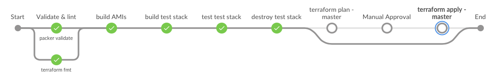
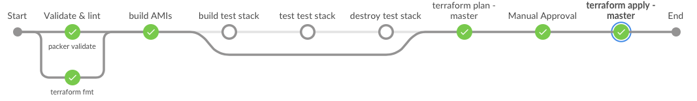

# Description

This is a Jenkins pipeline to create base ubuntu AMI (demo-baseline-ubuntu-...) and apache webserver AMI (demo-app-...) for AWS EC2 (t2.micro) instances and deploy the same apache AMI to 3 EC2 instances of an auto scaling group behind an ELB. All the infrastructure will be deployed in public subnet. This pipeline will also create cloudwatch alarms for the autoscaling group to automatically scale up if CPU utilization is greater than 60% and scale down if less than 40%.

This pipeline has mutiple stages as described below which are executed based on the branch (master and feature) where the a changes is being pushed/commited.

## Feature branch
Feature branch pipeline will be executed once commit is pushed in the respective feature branch as show below:



### Stages
<b><u> Validate & lint </u></b>

This stage will run `packer validate` for both `base/base.json` and `app/app.json` packages. This stage will use docker agent with `sourish88/hashicorp-pipeline` image.

<b><u> Terraform fmt </u></b>

This stage will verify the format of terraform files under `infra` folder. This stage will use docker agent with `sourish88/hashicorp-pipeline` image.

<b><u> Build AMIs </u></b>

This stage will create 2 AMIs (base and app) with `SHA` tag with value as SHA1 head of respective base and app folder in git. If the AMI already exist with SHA tag having value of current SHA1 head then it will not recreate that AMI. This stage will use docker agent with `sourish88/hashicorp-pipeline` image.

<b><u> Build test stack </u></b>

This stage will create temporary infrastructure (as mentioned above) for the generated apache AMI using terraform. This stage if they dont exist then will create S3 bucket to store tfstate of the branch as well as dynamo DB for maintain the locks on tfstate file. This stage will use docker agent with `sourish88/hashicorp-pipeline` image.

<b><u> Test test stack </u></b>

This stage with run `inspec` on the temporary infrastructure created in previous stage to verify if the AWS resources as per the profile in `aws-security` folder of this repo and generates the junit report. This stage uses `chef/inspec` image for docker agent.

<b><u> Destroy test stack </u></b>

Once previous stages are successfully completed, this stage will destroy the temporary infrastructure.

## Main branch

Master branch pipeline will be executed once PR is merged in the branch as show below:



### Stages
<b><u> Validate & lint </u></b>

This stage will run `packer validate` for both `base/base.json` and `app/app.json` packages. This stage will use docker agent with `sourish88/hashicorp-pipeline` image.

<b><u> Terraform fmt </u></b>

This stage will verify the format of terraform files under `infra` folder. This stage will use docker agent with `sourish88/hashicorp-pipeline` image.

<b><u> Build AMIs </u></b>

This stage will create 2 AMIs (base and app) with `SHA` tag with value as SHA1 head of respective base and app folder in git. If the AMI already exist with SHA tag having value of current SHA1 head then it will not recreate that AMI. This stage will use docker agent with `sourish88/hashicorp-pipeline` image.

<b><u> Terraform plan - master </u></b>

This stage will create terraform plan for the infrastructure (as mentioned above) based the apache AMI matching the SHA tage. This stage if they dont exist then will create S3 bucket to store tfstate of the branch as well as dynamo DB for maintain the locks on tfstate file. This stage will use docker agent with `sourish88/hashicorp-pipeline` image.

<b><u> Manual Approval </u></b>

This is to manually approve the terraform plan generated in previous stage. Once approved it will deploy terraform in next stage. You can reject the plan by aborting it.

<b><u> Terraform apply - master </u></b>

This will apply the trraform plan generated and approved in previous stages.

# How to use ?

## Prerequisites

1. Jenkins supporting docker agents
2. [AnsiColor](https://plugins.jenkins.io/ansicolor/)  plugin is installed
3. [CloudBees AWS Credentials
](https://plugins.jenkins.io/aws-credentials/) plugin is installed
4. AWS account with permissions to create VPC, EC2 instances, ELB, Autoscaling group and Cloudwatch alarms.

## Configuration

1. Add AWS access key and secret key in Jenkins global credentials as AWS Credentials named as 'demo-aws-creds'.
2. Add github credentials for jenkins to access this repository.
3. Generate ssh key pair using below command:
```
ssh-keygen -t rsa -b 4096 -C "Enter you comment"
```
4. Upload the generated public key as Jenkins secret file credntial named as 'PUBLIC_KEY'
5. Add multibranch pipeline using the Jenkinsfile in this repository. 